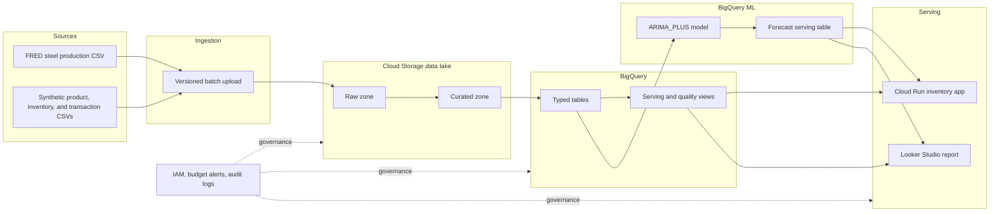

# Reference Architecture

The production design uses managed Google Cloud services and keeps public industry data separate from synthetic company operations data.

## Service roles

| Service | Role | Reason selected |
| --- | --- | --- |
| Cloud Storage | Raw and curated lake zones | Low-cost object storage with inspectable evidence |
| BigQuery | Typed warehouse, quality checks, and serving views | Serverless SQL analytics at classroom scale |
| BigQuery ML | ARIMA_PLUS time-series forecast | AI runs close to governed warehouse data |
| Cloud Run | Hosted planner application and API | Supports a custom HTML/CSS/JavaScript product |
| Looker Studio | Management KPIs and forecast report | Native BigQuery connection and shareable report |
| IAM | Runtime and instructor access controls | Least-privilege application access and grading visibility |

## Security and ethics

- The company dataset is synthetic and contains no real customer or confidential commercial information.
- Public FRED data is cited by series identifier and retained unchanged in the raw zone.
- The application runtime has BigQuery Job User and Data Viewer roles only.
- The instructor receives project Viewer access.
- Recommendations are advisory. A human must acknowledge an alert and approve procurement.
